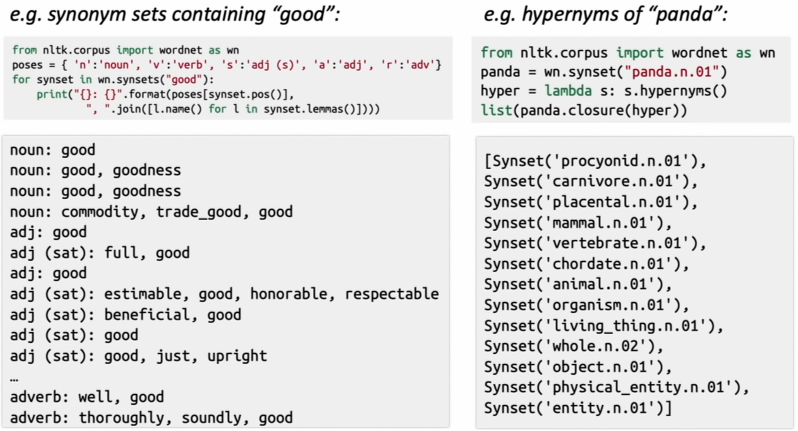
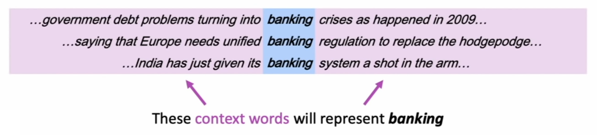
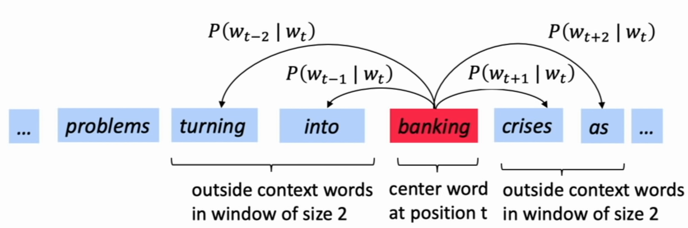

# Lecture 1 - Introduction and Word Vectors

## &sect;1 The Course

## &sect;2 Human Language and Word Meaning

* Example: xkcd cartoon
  * information function
  * social function
* human being vs. or orangutan
  * language
  * networking
  * writing

1. **How do we represent the meaning of a word?**

   Definition: **meaning**

   * the idea that is represented by a word, phrase, etc.
   * the idea that a person wants to express by using words, signs, etc.
   * the idea that is expressed in a work of writing, art, etc.

   ***Linguistic way*** of thinking of meaning:

   * ==**Denotational Semantics**==: *Signifier (symbol) $\Longleftrightarrow$ Signified (idea or thing)*

2. **How do we have usable meaning in a computer?**

   * <u>Common solution</u>: Use e.g. **WordNet**, a thesaurus containing lists of **synonym sets** and **hypernyms** ("is a" relationships).
     * **Problems with resources like WordNet**
       * Great as a resource but missing nuance
       * Missing new meanings of words, hard to keep up-to-date
       * Subjective
       * Requires human labor to create and adapt
       * Can't compute accurate word similarity

   

   * **Representing words as discrete symbols**

     * Discrete symbols - a **localist** representation: ``Means one 1, the rest 0s``

     * ==***One-hot Vectors***==

       * e.g. :
         * motel = [0 0 0 0 0 0 0 0 0 0 1 0 0 0 0]
         * hotel = [0 0 0 0 0 0 0 1 0 0 0 0 0 0 0]

       * $Vector\ Dimension\ =\ number\ of\ words\ in\ vocabulary\ (e.g., 500,000)$

     * **Problem with words as discrete symbols**

       * The two vectors are **orthogonal**: *no natural notion of **similarity** for one-hot vectors*
       * **Solution**:
         * Try to rely on WordNet's list of synonyms to get similarity?
           * Fail badly: incompleteness
           * ***Instead: learn to encode similarity in the vectors themselves***

   * **Representing words by their context**

     * <u>Distributional semantics</u>: **A word's meaning is given by the words that frequently appear close-by**
     * When a word *w* appears in a text, its ***context*** is the set of words that appear nearby (within a fixed-size window).
     * Use the many contexts of *w* to build up a representation of *w*.

   

   * **Word vectors**
     * Build a ***dense*** vector for each word, chosen so that it is similar to vectors of words that appear in similar contexts.
     * Word vectors are sometimes called **word embeddings** or **word representations**. They are **distributed** representations.
     * Visualization - vector space

## &sect;3 Word2vec Introduction

* **Word2vec** is a framework for learning word vectors.
* Idea:
  * large corpus of text
  * Every word in a fixed vocabulary is represented by a **vector**
  * Go through each position *t* in the text, which has a center word *c* and context ("outside") words *o*
  * Use the **similarity of the word vectors** for *c* and *o* to **calculate the probability** of *o* given *c* (or vice versa)
  * **Keep adjusting the word vectors** to maximize this probability

* Word2vec: objective function
  * For each position *t = 1, ..., T*, predict context words within a window of fixed size *m*, given center word *wj*.
  * 

$$
Likelihood = L(\theta) = \prod_{t=1}^{T}\prod_{-m\leq j\leq m \&\& j\neq 0}P(w_{t+j}|w_{t};\theta)
$$
* 
    * 
    * 

## &sect;4 Word2vec Objective Function Gradients

## &sect;5 Optimization Basics

## &sect;6 Looking at Word Vectors

